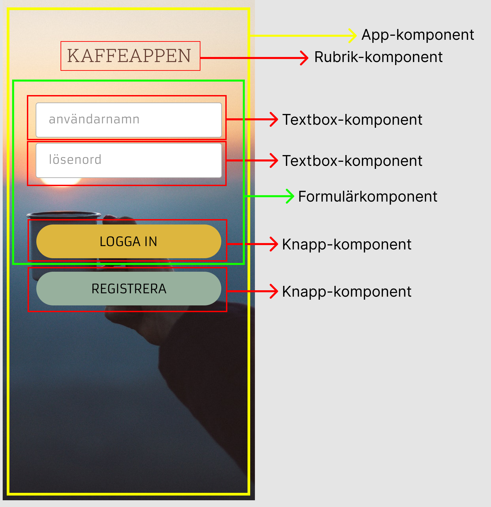
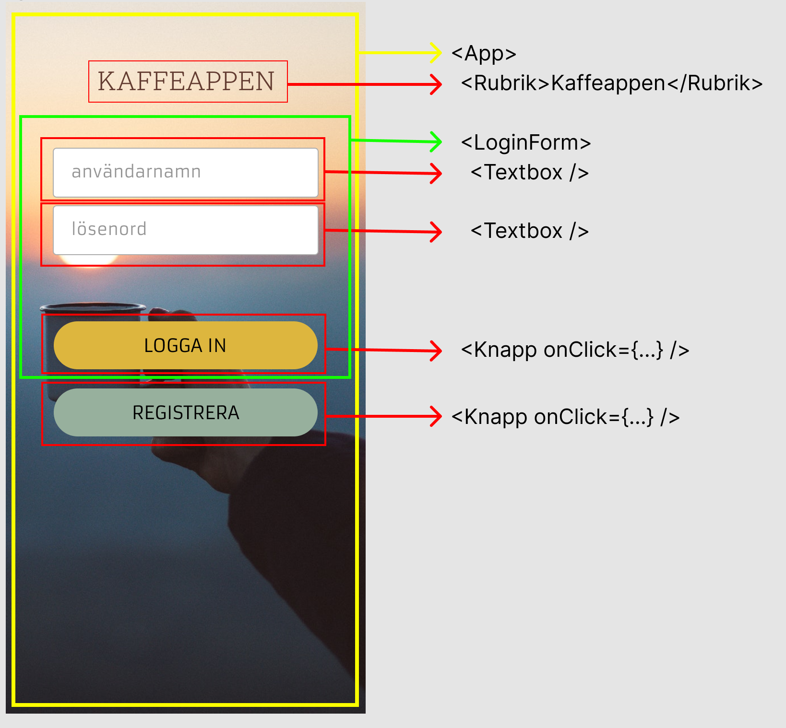

# React - intro, komponenter

## Vad är React?

- Ett ramverk för att bygga användargränssnitt
- Skapat av Facebook, lanserat 2013
- Används av bl.a. Facebook, Instagram, Netflix, Airbnb, Uber, ...

## En applikation byggd av komponenter

- En React-applikation består av komponenter
- En komponent kan i sin tur innehålla andra komponenter
- På så sätt kan vi få en välstrukturerad kod






## Komponentstruktur i kod

```jsx
<App>
    <Rubrik>Kaffeappen</Rubrik>
    <LoginForm>
        <Textbox />
        <Textbox />
        <Knapp onClick={...} />
    </LoginForm>
    <Knapp onClick={...} />
</App>
```

## Hur skapar man en React-komponent?

- En komponent är en funktion som returnerar JSX
- JSX är en blandning av HTML och Javascript
- JSX kompileras till vanlig Javascript

```jsx
const BildKomponent = () => {
    return 
}
```

## Hur använder vi en komponent?

- Vi använder en komponent som om det vore ett HTML-element
- Vi kan skicka med data till en komponent med hjälp av attribut
- Vi kan skicka med andra komponenter som barn

```jsx
const BildKomponent = () => {
    return 
}

const App = () => {
    return (
        <div>
            <BildKomponent />
            <BildKomponent />
            <BildKomponent />
        </div>
    )
}
```

## Hur skickar vi data till en komponent?

- Vi skickar med data som attribut
- Vi kan använda attributen i komponenten
- Det som skickas in i en komponent kallas för **props**

```jsx
const BildKomponent = (props) => {
    return 
}

const App = () => {
    return (
        <div>
            <BildKomponent src="bild.jpg" />
            <BildKomponent src="bild2.jpg" />
            <BildKomponent src="bild3.jpg" />
        </div>
    )
}
```

## Hur skickar vi andra komponenter som barn?

- Vi skickar med andra komponenter som barn
- Vi kan använda barnen i komponenten
- Det som skickas in i en komponent kallas för **children**

```jsx
const RubrikKomponent = (props) => {
    return <h1>{props.children}</h1>
}

const App = () => {
    return (
        <div>
            <RubrikKomponent>Kaffeappen</RubrikKomponent>
        </div>
    )
}
```

## Destructa props

- Vi kan använda destructuring för att plocka ut props

```jsx
const BildKomponent = ({ src }) => {
    return 
}
```

## Vad är en hook?

- En hook är en funktion som används i en komponent
- Du känner igen en hook på namnet som börjar på `use`:
  - `useState`
  - `useEffect`
  - `useRef`
  - `useContext`
- Hooks används för att hantera tillstånd och sideffekter
- Sideffekter är t.ex. att hämta data från ett API
- Tillstånd är t.ex. om en knapp är nedtryckt eller inte

## useState

- Används för att hantera tillstånd i en komponent
- Returnerar en array med två värden
- Det första värdet är tillståndet
- Det andra värdet är en funktion för att uppdatera tillståndet

```jsx
const [count, setCount] = useState(0)

```

## useEffect

- Används för att hantera sideffekter i en komponent
- Tar emot en array med beroenden
  - Är den tom körs funktionen en gång
  - Innehåller den värden körs funktionen när något av värdena ändras
  - Utan array körs funktionen varje gång komponenten renderas

```jsx
useEffect(() => {
    console.log('Komponenten har renderats')
}, [])
```