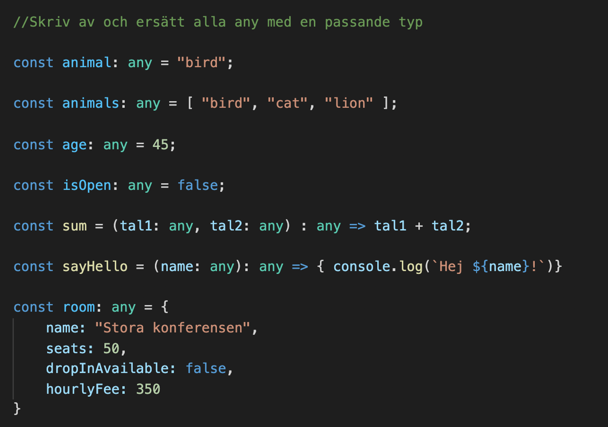
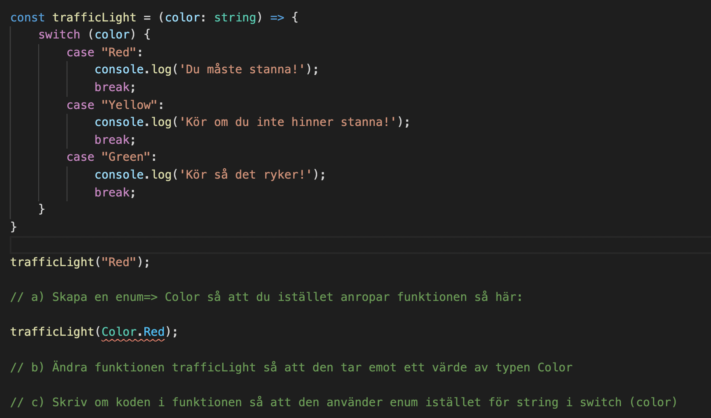
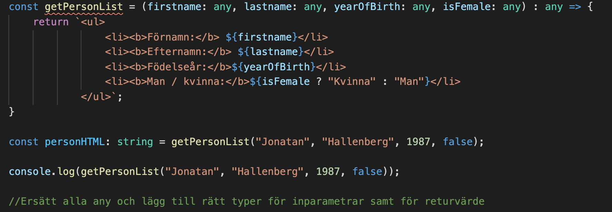
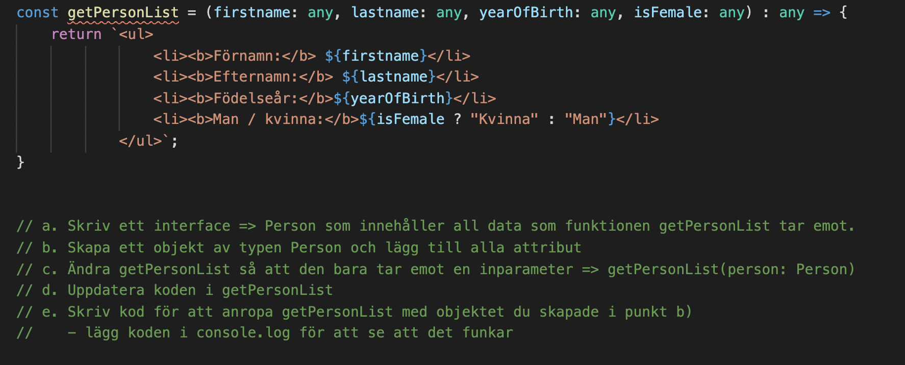
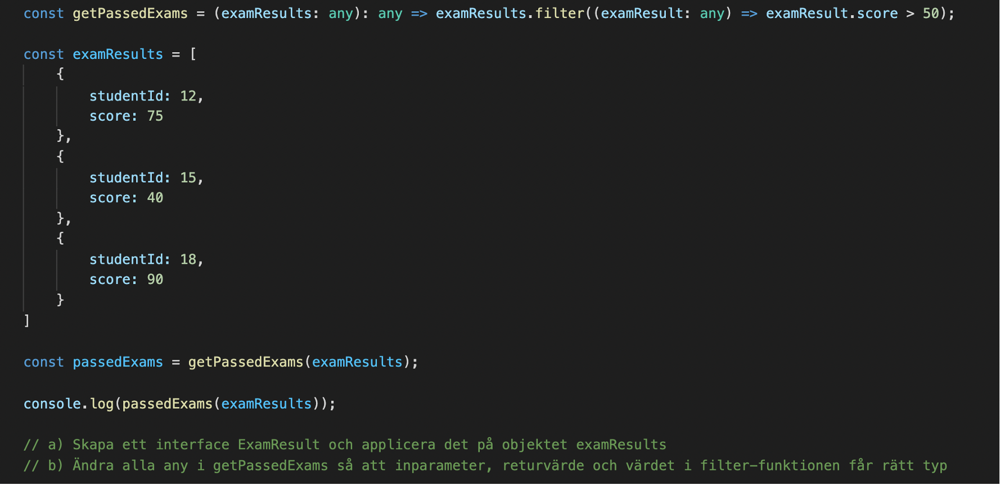

# Övningar - Typescript

## Komma igång

1. Skapa en katalog
2. Öppna med VSCode
3. Kör i terminalen:

```sh
npm init
npm install typescript --save-dev
npm install nodemon --save-dev
npm install ts-node --save-dev
npx tsc --init
```

5. Skapa en fil för att köra din kod, t.ex. code.ts
6. Lägg till start-script i package.json:

```sh
...
{
  "start": "nodemon code.ts"
}
...
```

7. Kör **npm start**

**Nu är det bara att börja skriva typescript-kod!**

---

**1) Typa variabler / objekt**

  

---

**2) Enum**

  

**3) Funktion**

  

**4) Interface**



**5) Array / Funktion / Interface**

